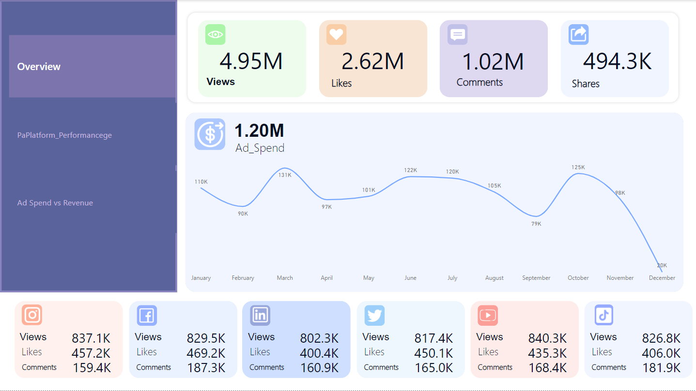

# Track Social Media Performance Metrics for 2024

## Overview
This project demonstrates an analytics dashboard created using Power BI to visualize and track platform performance metrics for 2024. The dashboard highlights:
- **Total Views, Likes, Comments, and Shares** across multiple platforms.
- **Ad Spend vs Revenue Analysis**.
- **Comparison of Engagement Metrics** across platforms such as Facebook, Instagram, LinkedIn, TikTok, Twitter, and YouTube.

## Features
- 📊 Interactive visualizations for key performance indicators.
- 📈 Comparison charts to analyze trends over time.
- 💡 Insights into ad spending efficiency and its impact on revenue.

## Screenshots and Insights

### 1. Overview Page

**Analysis:**
- Total Views: 4.95M, Likes: 2.62M, Comments: 1.02M, and Shares: 494.3K.
- The overall engagement metrics show high levels of user interaction, with views leading as the most significant metric.
- The Ad Spend trend indicates peaks in March, October, and November, aligning with seasonal campaign efforts or high-performing ads.

---

### 2. Views and Revenue Analysis

**Analysis:**
- Platforms with the highest revenue: YouTube ($1.87M), Instagram ($1.82M), and TikTok ($1.69M).
- Despite lower engagement on LinkedIn, its revenue ($1.57M) is comparable to TikTok and Instagram, suggesting better conversion rates or higher ad prices.
- The comparison chart highlights that Facebook has the most shares, while Instagram excels in likes.

---

### 3. Ad Spend vs Revenue

**Analysis:**
- Total Ad Spend: $1.20M compared to Total Revenue: $10.13M, indicating a strong ROI.
- October has the highest revenue, likely due to seasonal marketing or viral campaigns.
- YouTube and Instagram show the best efficiency in converting ad spend into revenue compared to other platforms.

---

## How to Use
1. Download the `.pbix` file from this repository.
2. Open the file in Power BI Desktop to explore the dashboard interactively.

## Technologies Used
- **Power BI**: For data visualization and analytics.
- **Microsoft Excel**: For initial data preparation and structuring.

## Contact
Feel free to reach out if you have any questions or suggestions!

- Email: abdulrahman.hu.ya@gmail.com

- LinkedIn: [My account in LinkedIn ](https://www.linkedin.com/in/abduhuya/)
